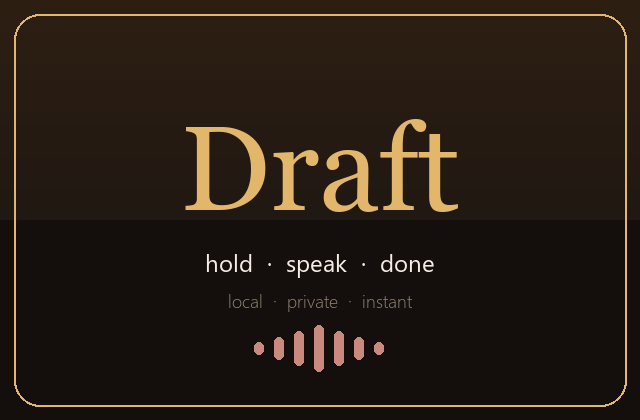

# Draft — fastest local speech-to-text for Windows

Hold **Right Ctrl**, speak, release — text appears wherever your cursor is.
GPU-accurate, fully offline, free forever. No cloud, no account, no subscription.



## Why Draft

Most dictation tools make you choose: **fast** (tiny model, sloppy output) or
**accurate** (giant model, slow, cloud round-trip). Draft refuses the tradeoff
by pairing a large-accuracy engine with a GPU it can actually use:

| | Draft (Pro) | Draft (Flash) | Typical cloud tool |
|---|---|---|---|
| Engine | faster-whisper `large-v3-turbo` | Whistle 16.9 MB | server-side large model |
| Device | NVIDIA GPU (float16), CPU fallback | CPU | remote GPU + network |
| Speed (RTX 4060) | **~12x realtime** (~0.4 s for 5 s of speech) | ~11x realtime | ~0.5 s + round-trip |
| Privacy | 100% on-device | 100% on-device | audio leaves your PC |
| Price | free, offline after install | free | subscription |

Measured on this machine: 19.2 s of speech transcribed in **1.6 s** with zero
errors on clean audio; Whistle hits first token in **~11 ms** on CPU.

Accuracy doesn't come from the model alone. Every take runs through a
pipeline: 16 kHz native capture → DC removal → gentle auto-gain → energy-VAD
silence trim → decode with **hotword + initial-prompt guidance** → teachable
corrections → filler cleanup → light formatting. Words are never rewritten by
an LLM — what you said is what you get.

## Install (2 minutes)

1. Install Python 3.12+ from [python.org](https://www.python.org) (tick **Add to PATH**).
2. Double-click **`install.bat`** — installs packages, pre-downloads speech models once.
3. Double-click **`Draft.bat`**.

No admin rights needed. An NVIDIA GPU is auto-detected; without one, the Pro
engine runs on CPU and Flash mode covers instant takes.

Prefer a single file? Run **`build_exe.bat`** → `dist/Draft/Draft.exe`, then
**`install_app.bat`** for Start Menu + Desktop shortcuts and start-with-Windows.
Models (~800 MB) download once on first launch and stay cached.

## Use

| Action | How |
|---|---|
| Dictate | **Hold `Right Ctrl`**, speak, **release** — pasted at your cursor |
| Long takes | **`F9`** toggles (up to 60 s), live words while you speak |
| Open the dashboard | **`Ctrl+Alt+D`** from anywhere (all hotkeys remappable) |
| Discard a take | Say *“scratch that”* |
| Line breaks | Say *“new paragraph”* / *“new line”* (also mid-sentence) |
| Teach a word | Settings → ★ Taught words: `tiroop` → `Tirup` (guaranteed + decode-biased) |
| Names & products | Settings → ✎ Hotwords, comma-separated |

Closing the window minimizes to the **system tray** — hotkeys keep working 24/7.
Quit from the tray menu. History, stats, compose mode and per-engine/language/
mic settings live in the tabbed dashboard.

## Configuration

Settings persist to `%LOCALAPPDATA%\Draft\config.json`:

| Key | Default | Meaning |
|---|---|---|
| `engine_mode` | `pro` | `pro` (accurate) / `flash` (instant) |
| `paste_mode` | `direct` | `direct` paste on release / `compose` to gather takes |
| `language` | `auto` | `auto` or `en de fr es it nl pl` |
| `mic` | `default` | `default`, device index, or name fragment |
| `hotwords` | `""` | decode-time bias for names/products |
| `corrections` | *see below* | guaranteed `heard → written` pairs + `X dot Y` joining |
| `voice_commands` | `true` | scratch-that / paragraph / line |
| `live_partials` | `true` | words appear while speaking |
| `remove_fillers` / `smart_dots` | `true` | drop um/uh; join `tirup dot in` → `tirup.in` |
| `autostart` / `start_minimized` | `true` / `false` | start with Windows / start in tray |
| `theme` | `golden` | `golden` / `midnight` |

## Project structure

```text
draft.py            the whole app: engines, mic, hotkeys, tray, overlay, UI
requirements.txt    pinned runtime deps
install.bat         one-click dev setup + model pre-download
run.bat / Draft.bat launchers (dev mode)
build_exe.bat       PyInstaller build: onedir, splash, version info, CUDA libs
install_app.bat     user-level install: shortcuts, autostart, no admin needed
uninstall.bat       clean removal (keeps models + history unless asked)
patch_app.bat       ships draft.py as a live patch in seconds (no rebuild)
assets/             icon, splash, tray art + generator, exe version metadata
```

### How the pieces fit

- **Engines** — `ProEngine` (faster-whisper, CUDA float16 → CPU int8 fallback)
  and `FlashEngine` (Whistle, CPU) behind one `EngineManager` with automatic
  fallback. Both stay loaded; a watchdog reloads them after repeated failures.
- **Accuracy layer** — hotwords + an `initial_prompt` are built automatically
  from taught words, so vocabulary wins at *decode* time; a corrections map
  guarantees it post-decode (`model registry tirup in` → `modelregistry.tirup.in`
  even when the model hears it wrong).
- **Latency path** — mic opens on the hotkey thread (~ms), clipboard+`Ctrl+V`
  paste (~30 ms), original clipboard restored. The UI never blocks audio.
- **Desktop integration** — global hotkeys (`keyboard`), system tray
  (`pystray`), autostart via `HKCU\...\Run`, single-instance guard, file logging
  to `%LOCALAPPDATA%\Draft\draft.log`.
- **Shipping** — the exe bundles its own CUDA math libs (no toolkit needed),
  torch/transformers and duplicate DLLs stripped (~1 GB, of which ~740 MB is
  NVIDIA math). `patch_app.bat` overlays a newer `draft.py` next to the exe
  for second-scale updates without rebuilding.

## Build from source

```bat
install.bat
py -3.13 draft.py        :: dev mode
build_exe.bat            :: -> dist\Draft\Draft.exe
install_app.bat          :: install + autostart
```

## Troubleshooting

- **Engines still loading** — first run downloads ~800 MB; watch the log lines.
- **CUDA/cuBLAS errors** — the app prepends NVIDIA wheel paths itself and
  falls back to CPU; reinstall via `install.bat` if it persists.
- **Wrong language** — set it explicitly instead of `auto`.
- **Names misheard** — add them to **Hotwords**, or teach the exact
  mishearing under **★ Taught words**.
- **Hotkeys dead** — avoid keys other apps swallow; the mouse button and
  `Ctrl+Alt+D` always work. Left vs right modifiers are distinguished
  (selecting Right Ctrl means left Ctrl stays silent, by design).
- **Paste lands wrong** — click the target field first; Draft never steals focus.

## Credits

- Speech: OpenAI Whisper family via [**faster-whisper**](https://github.com/SYSTRAN/faster-whisper)
  (CTranslate2) and [**Whistle**](https://cactuscompute.com/blog/whistle) by Cactus Compute
- UI: [customtkinter](https://github.com/TomSchimansky/CustomTkinter),
  [pystray](https://github.com/moses-palmer/pystray)

## License

MIT — see [LICENSE](LICENSE).
